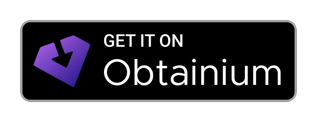

# Offsides

A third-party Android app for [Sidechat](https://sidechat.lol).  Many thanks to [SidechatProxy](https://github.com/OrenKohavi/SidechatProxy) and its author [Oren Kohavi](https://github.com/OrenKohavi), both of whom have been instrumental in this app's development.

> [!IMPORTANT]
> Offsides is being [depreciated](https://www.reddit.com/r/Offsides/comments/1unue0p/offsides_likely_shutting_down_soon) in favor of the upcoming official YikYak app for Android.  All code and downloads will remain available and open-source, but support is not guaranteed.

## Downloading Offsides

As a reverse-engineered app, Offsides will not be coming to the Google Play Store.  You can install it manually by downloading the [latest release APK](https://github.com/micahlt/offsides/releases/latest) or clicking the button below to install it with [Obtainium](https://obtainium.imranr.dev) (which gives you nice features like auto-update).

[](https://apps.obtainium.imranr.dev/redirect?r=obtainium://add?url=https://github.com/micahlt/offsides)

## Developing Offsides

Offsides is a [React Native](https://reactnative.dev) app using the [Expo SDK](https://expo.dev).

> [!NOTE]
> Make sure you have completed the [Expo Environment Setup](https://docs.expo.dev/get-started/set-up-your-environment) instructions before proceeding.

You can develop Offsides using the `npm run` commands:

```bash
npm run android
```

This will start the Expo dev server as well as open the app in the Android emulator or a physical device if you have ADB set up.  Logical changes to how the YikYak/Sidechat API is accessed must be changed in the upstream [sidechat.js](https://github.com/micahlt/sidechat.js) project.